Beets: A Guided Walkthrough
===========================

Overview
--------

This is a step by step walkthrough for getting started with the beets
CLI using a sample music library. The sample music library includes
public domain recordings of Debussy, Chopin, and Virginia Liston
compiled from Open Music Archive, IMSLP, and Internet Archive.

We will use this library in its messy/unaltered state to showcase the
power of the beets CLI by correcting obscure metadata and organizing the
music library with the auto-tagger (and a little manual input). Lastly,
we will host the library locally using the beets web plugin to stream
the audio once finished and admire our results. Let’s get started!

If desired, there are resources included below to help find additional
recordings that are in the public domain if you’d like to grow your
sample music library. Note: be sure the release you’re looking to
include has metadata in the MusicBrainz database for best results.

Installing and configuring beets
--------------------------------

Following are brief instructions for downloading and installing the
beets CLI. For detailed instructions, head over to the official
documentation here: `Getting
Started <https://beets.readthedocs.io/en/stable/guides/main.html>`__.

Download beets with ``pip install beets``

Write your config in ``~/.config/beets/config.yaml`` specifying a
directory for your copied music and a library for a database file to
store an index of your music.

My ``config.yaml`` looks like this:

.. code:: yaml

   directory: ~/beets/music
   library: ~/beets/data/musiclibrary.db
   plugins: web

All I’ve done to support the above config is create the ``beets``
directory inside my home folder, with empty child directories for
``music`` and ``data`` inside it. You can place your music library and
data store wherever you like, and you don’t need to create the
``musiclibrary.db`` file, it will be created for you.

Importing the sample library
----------------------------

First, download the .zip archive of the sample music library from
`this <https://bit.ly/3EZb5ue>`__ public google drive file, extract the
contents and take note of the path to the sample library for later use.

Take a second to scrub through the library’s organization and
inconsistent file naming. On a small scale this is a prime example of
how messy a music library can be in its raw form, with no standard for
metadata or organization.

Enter beets! We’re going to clean up this mess and make our library
beautiful.

Run ``beet import {path to sample library}`` to import the messy sample
library and start using the beets auto-tagger.

In my case the path to the sample library is also in my home folder, so
I will run the command ``beet import ~/sample-library``

The autotagger starts work on Album 1, and the closest match is
selection ``1``, go ahead and enter that in the prompt.

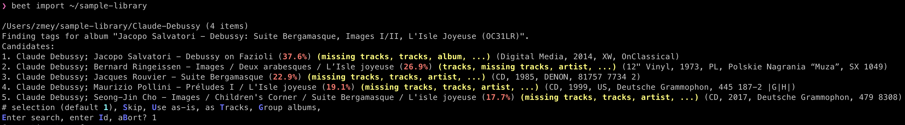

Next, enter ``a`` to apply the changes found to Album 1.

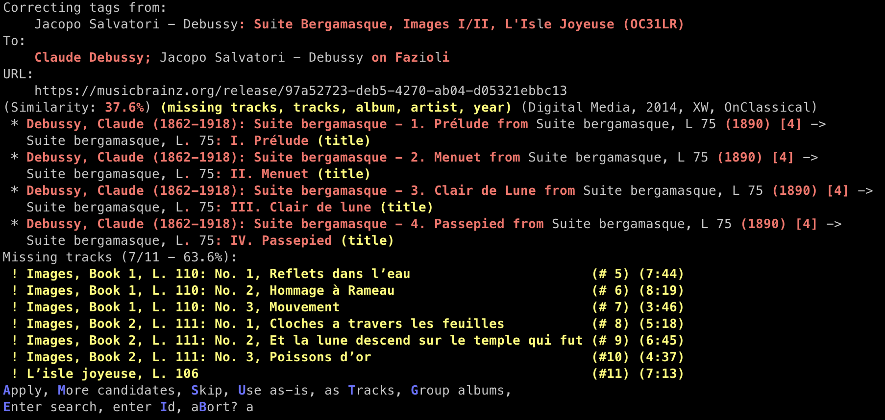

Album 2 doesn’t have a matching release, so we will enter one manually
by entering ``i`` and then the following MusicBrainz id
``96581fca-a7b1-4c94-bb23-7b0df9f00507``

Accept the changes for our manual match by selecting ``a``

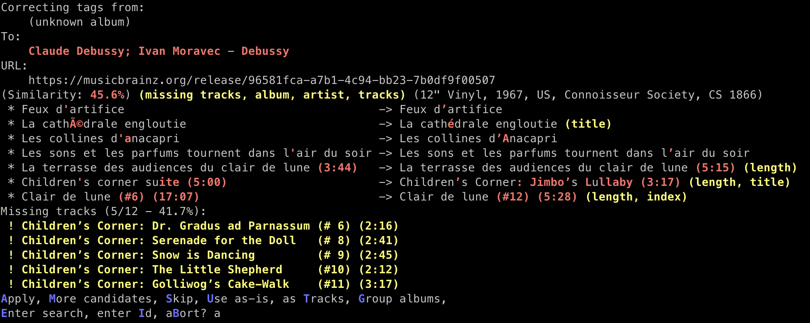

Album 3 doesn’t have a matching release either, so we will enter one
manually with ``i`` and then the following MusicBrainz id
``95440be5-cff3-4222-8ddc-5b7ecb99a351``

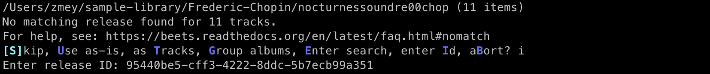

We’ve located the correct album, however we only have 11/48 tracks
across a compilation of 3 CDs, hence the large output warning us of
missing tracks.

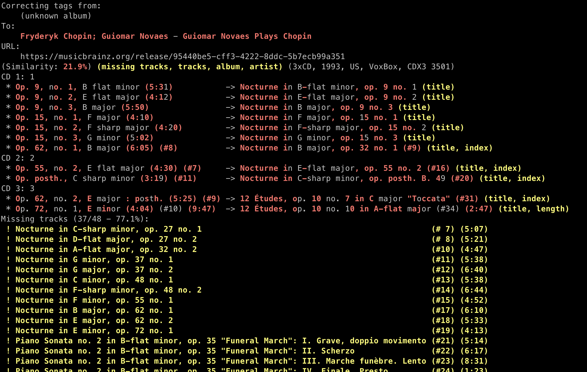

The autotagger has done a decent job, but it has incorrectly matched
tracks 7, 10, and 11 due to similar titles in other tracks throughout
the compilation. We’ll use this opportunity to re-tag the offending
tracks later in the next section.

For now, accept the changes for our manual match by selecting ``a``

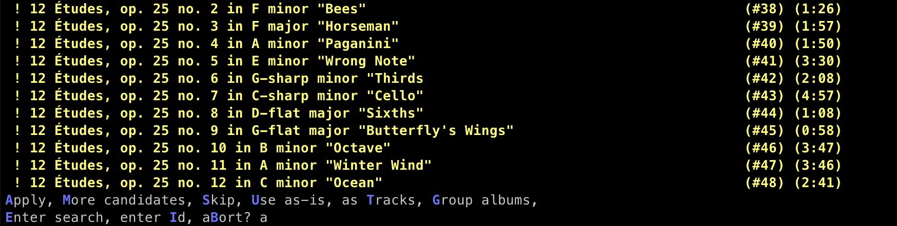

Album 4 is a series of singletons with a number of matches found by the
autotagger.

Accept these changes and import the tracks with the ``t`` flag for
individual tracks

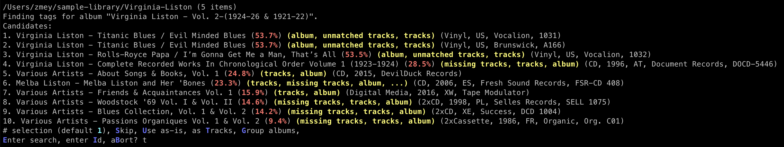

The output should look like the following:

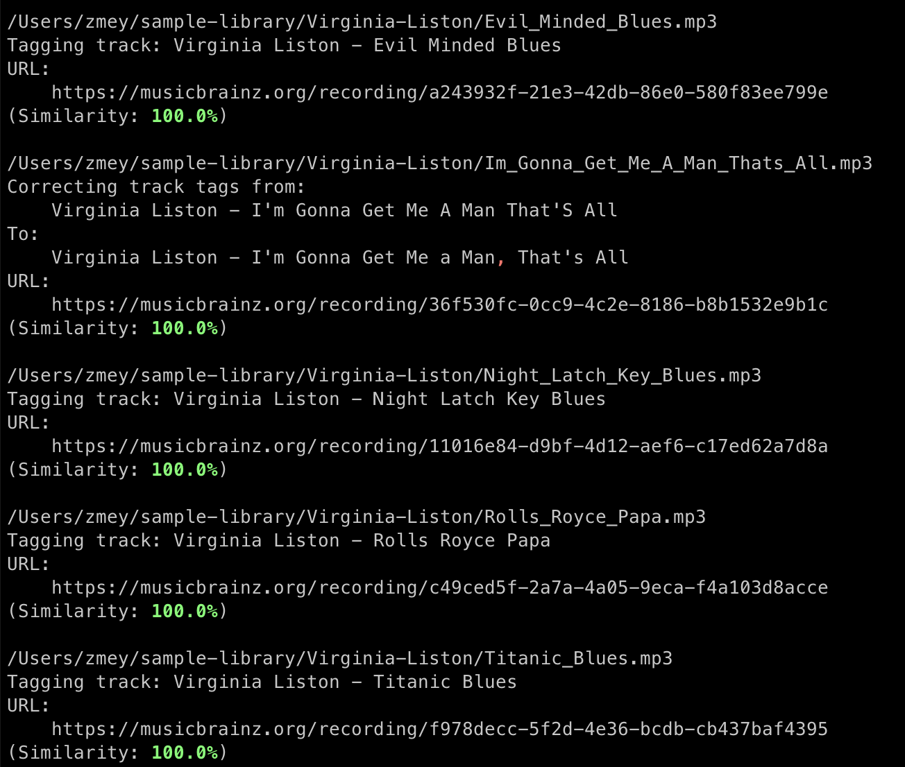

Finally, let’s check out our library in its current state with
``beet list``

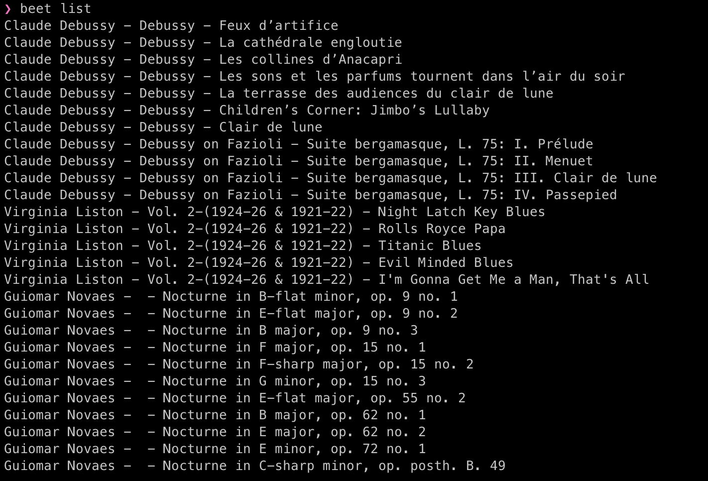

We’ve made significant progress! Now let’s correct some discrepencies
that came up between the autotagger and our library.

Correcting a mistake in the sample library
------------------------------------------

We can use the command ``beet fields`` to see all the metadata that can
be updated for each track in the library, in our case we’re interested
in updating the ``title`` and ``mb_trackid`` fields to correct a series
of mistakes in a couple of our albums.

Mistake: Album 2 - Swapped track titles and metadata
~~~~~~~~~~~~~~~~~~~~~~~~~~~~~~~~~~~~~~~~~~~~~~~~~~~~

There are two tracks in our download of Moravec’s Debussy album where
the titles and metadata are swapped. “Children’s Corner: Jimbo’s
Lullaby” and “Clair de lune” incorrectly refer to the opposite
recording, let’s change that with beets!

1. Rename “Clair de lune” with the following command
   ``beet modify Clair de lune title="Children's Corner Suite"``

Why not name this “Children’s Corner: Jimbo’s Lullaby”? Well, there’s
another mistake in our album: this track is actually a 17 minute long
recording of all movements from the “Children’s Corner” Suite, which are
typically broken up track by track in a traditional release. We are
renaming this way to more accurately reflect the recording we have in
our library.

When running the command above, it will attempt to modify more than one
track (since another track has the term “clair de lune” within its
title), so use the select flag ``s`` to systematically deny or approve
the title update for multiple tracks one by one. This ensures that we
only update the title for the track “Clair de lune”.

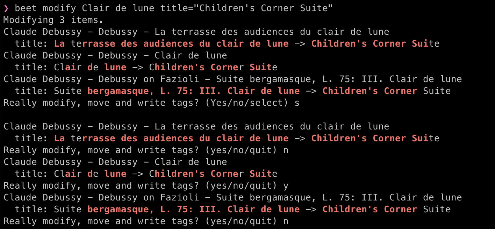

Next, update the MusicBrainz track id with the following command
``beet modify Children\'s Corner Suite mb_trackid=9c7f4fc2-0d2b-42b6-99fd-6ac2cdf32123``

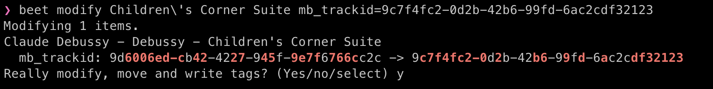

This way our metadata for this track is correct. We will see a
demonstration for why this is important later when we view our tracks
with the web plugin.

2. Rename “Children’s Corner: Jimbo’s Lullaby” with the following
   command ``beet modify lullaby title="Clair de lune"``

Be sure to update the MusicBrainz track id for this track as well with
``beet modify "Clair de lune" mb_trackid=9d6006ed-cb42-4227-945f-9e7f6766cc2c``
and the ``s`` tag to select and update the correct track.

.. image:: ./img/album2-correct-title-id-2.png

Exercise - Mistake: Album 3 - Incorrect titles and metadata
~~~~~~~~~~~~~~~~~~~~~~~~~~~~~~~~~~~~~~~~~~~~~~~~~~~~~~~~~~~

There are three tracks we need to correct in Album 3. Use your knowledge
of beets’ ``modify`` command from the previous mistake we corrected to
update the ``title`` and ``mb_trackid`` fields for each of the tracks
below.

+--------------+--------------------+---------------+-----------------+
| first title  | current title      | new title     | mb_trackid      |
|              | (incorrect)        | (correct)     | (correct)       |
+==============+====================+===============+=================+
| Op. 62, no.  | Nocturne in B      | Nocturne in B | dda32c          |
| 1, B major   | major, op. 32 no.  | major, op. 62 | 0b-bd61-45f3-bb |
|              | 1                  | no. 1         | 98-682bc4dbf065 |
+--------------+--------------------+---------------+-----------------+
| Op. 62, no.  | 12 Études, op. 10  | Nocturne in B | 4cec94          |
| 2, E major:  | no. 7 in C major   | major, op. 62 | 44-351d-49c8-a4 |
| posth.       | “Toccata”          | no. 2         | 2e-51734c6f27fe |
+--------------+--------------------+---------------+-----------------+
| Op. 72, no.  | 12 Études, op. 10  | Nocturne in E | 1dc710          |
| 1, E minor   | no. 10 in A-flat   | minor, op. 72 | 83-bb07-46c4-97 |
|              | major              | no. 1         | 65-094cc3a3469c |
+--------------+--------------------+---------------+-----------------+

Check-in
--------

At this point we have cleaned up an otherwise messy music library into a
clean and updated public domain library of music. If we run
``beet list`` we can see it in all its glory. Next, let’s host it on the
web!

Setting up a server with the web plugin
---------------------------------------

-  Following are brief instructions for setting up the beets web plugin.
   For detailed instructions, head over to the official documentation
   here: `Web
   Plugin <https://beets.readthedocs.io/en/stable/plugins/web.html>`__.
-  To use the beets web plugin we’ll need to download flask with
   ``pip install flask``
-  Update the beets ``config.yaml`` with ``beet config -e`` and add the
   line ``plugins: web`` to the end (if you haven’t already)
-  Start up the server for the library with ``beet web`` and navigate to
   http://localhost:8337 to query, view, and listen to the music
-  If you search “Debussy” and play “Clair de lune” (which is a track
   who’s ``title`` and ``mb_trackid`` we modified), then click “view”
   next to “MusicBrainz entry”, you’ll notice it correctly navigates us
   to the page for the updated track in the MusicBrainz database.

Conclusion
----------

Thanks for coming along on this journey! You can now enjoy an organized
and well-documented sample music library of recordings found in the
public domain, and take your newfound knowledge of beets to import
music, correct metadata, and maintain your collection of
incomplete/messy downloads. Happy listening!

--------------

Sample Music Library Sources
----------------------------

Debussy - Jacopo Salvatori

-  `Download <https://imslp.org/wiki/Suite_bergamasque_(Debussy%2C_Claude)>`__
-  `MusicBrainz <https://musicbrainz.org/release/3d317801-cad6-4068-8544-35c545ad9ca9>`__

Debussy - Ivan Moravec

-  `Download <https://archive.org/details/debussysoundreco00debu/07_Children_s_corner_suite.mp3>`__
-  `MusicBrainz <https://musicbrainz.org/release/96581fca-a7b1-4c94-bb23-7b0df9f00507>`__

Frederic Chopin - Guiomar Novaes

-  `Download <https://archive.org/details/nocturnessoundre00chop>`__
-  `MusicBrainz <https://musicbrainz.org/release/95440be5-cff3-4222-8ddc-5b7ecb99a351>`__

Virginia Liston

-  `Download <http://www.openmusicarchive.org/browse_tag.php?tag=Virginia%20Liston>`__
-  `MusicBrainz <https://musicbrainz.org/artist/68ec4f9a-ca42-44a4-80a8-ef2c99cb5bf7>`__
