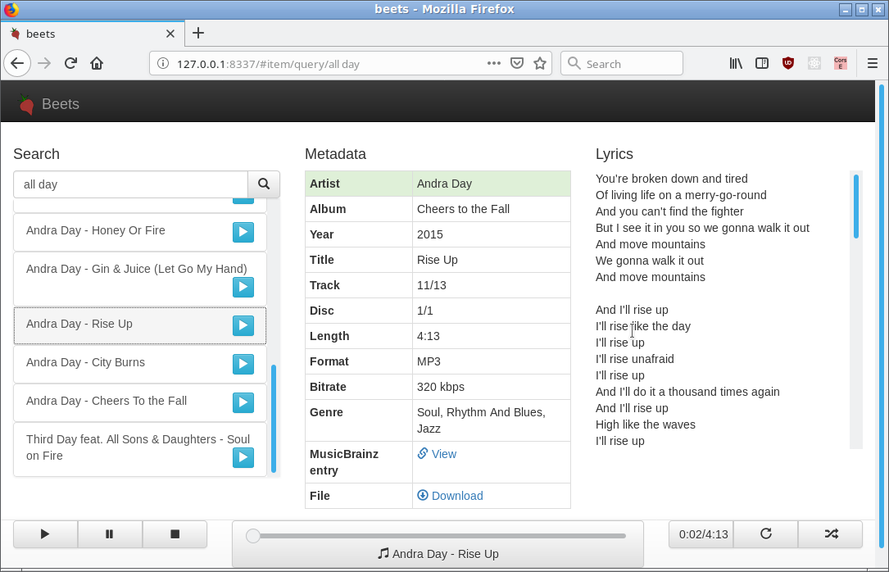

Web Plugin
==========

The ``web`` plugin is a very basic alternative interface to beets that
supplements the CLI. It can't do much right now, and the interface is a little
clunky, but you can use it to query and browse your music and---in browsers that
support HTML5 Audio---you can even play music.

While it's not meant to replace the CLI, a graphical interface has a number of
advantages in certain situations. For example, when editing a tag, a natural CLI
makes you retype the whole thing---common GUI conventions can be used to just
edit the part of the tag you want to change. A graphical interface could also
drastically increase the number of people who can use beets.

Install
-------

The Web interface depends on `Flask`_. To get it, just run ``pip install
flask``.

.. _Flask: http://flask.pocoo.org/

Put ``plugins=web`` in your ``.beetsconfig`` to enable the plugin.

Run the Server
--------------

Then just type ``beet web`` to start the server and go to
http://localhost:8337/. This is what it looks like:

You can also specify the hostname and port number used by the Web server. These
can be specified on the command line or in the ``[web]`` section of your
[Usage#Configuration .beetsconfig].

On the command line, use ``beet web [HOSTNAME] [PORT]``. In the config file, use
something like this::

    [web]
    host=127.0.0.1
    port=8888

Usage
-----

Type queries into the little search box. Double-click a track to play it with
`HTML5 Audio`_.

.. _HTML5 Audio: http://www.w3.org/TR/html-markup/audio.html

Implementation
--------------

The Web backend is built using a simple REST+JSON API with the excellent
`Flask`_ library. The frontend is a single-page application written with
`Backbone.js`_. This allows future non-Web clients to use the same backend API.

.. _Flask: http://flask.pocoo.org/
.. _Backbone.js: http://documentcloud.github.com/backbone/

Eventually, to make the Web player really viable, we should use a Flash fallback
for unsupported formats/browsers. There are a number of options for this:

* `audio.js`_
* `html5media`_
* `MediaElement.js`_

.. _audio.js: http://kolber.github.com/audiojs/
.. _html5media: http://html5media.info/
.. _MediaElement.js: http://mediaelementjs.com/
